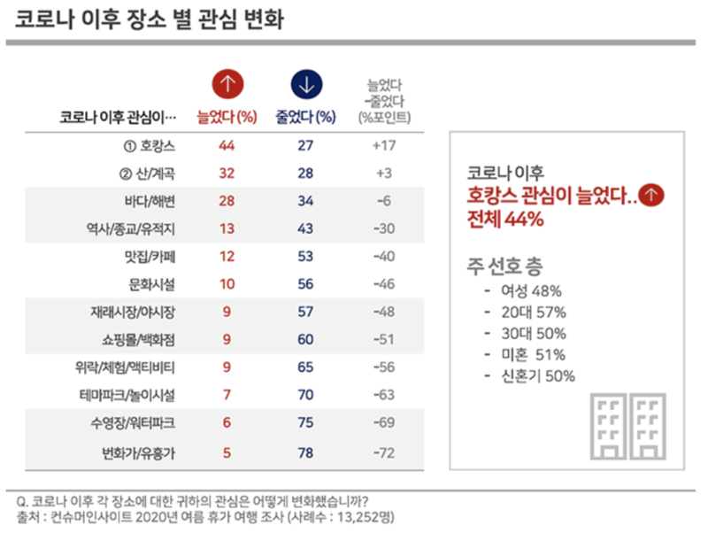
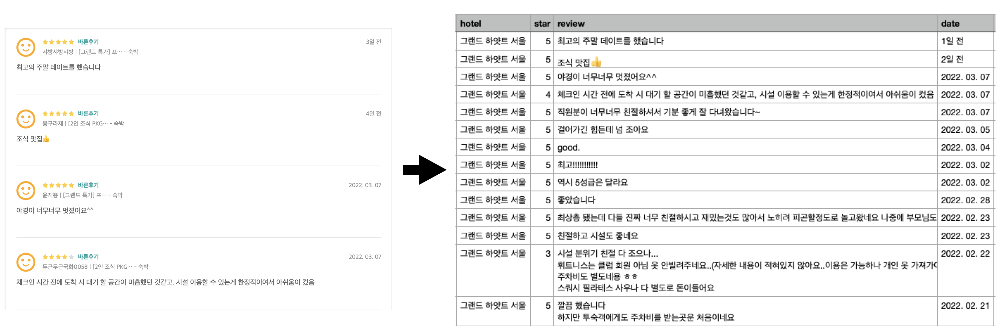

# Hotel_Review_Sentiment_Analysis(BERT)

### ✔️ 프로젝트 주제  

- 코로나 이후 여행장소 측면에서 소비자들의 관심이 가장 크게 높아진 곳은 호텔(호캉스)이며, 이는 대표적인 언택트(비대면)  
여행 장소로 각광받고 있는 추세이다.  
- '언택트'와 '휴식'에 초점을 맞춘 여행 트렌드는 앞으로도 지속될것으로 보이며, 최근 2년간('20~'21년) 고객들의 실제 리뷰와  
 평점을 바탕으로 긍정/부정 리뷰를 분류하고 예약시에 도움이 되는 서비스를 제공합니다.  

### ✔️ Pipeline 

1. 데이터 수집  

- 호텔예약플랫폼 이용률 1위 '야놀자' 활용 서울,인천송도의 주요 호텔 11곳에 대한 리뷰데이터(22921개) Crawling 진행  
- 호텔명, 리뷰텍스트, 리뷰작성일 추출
